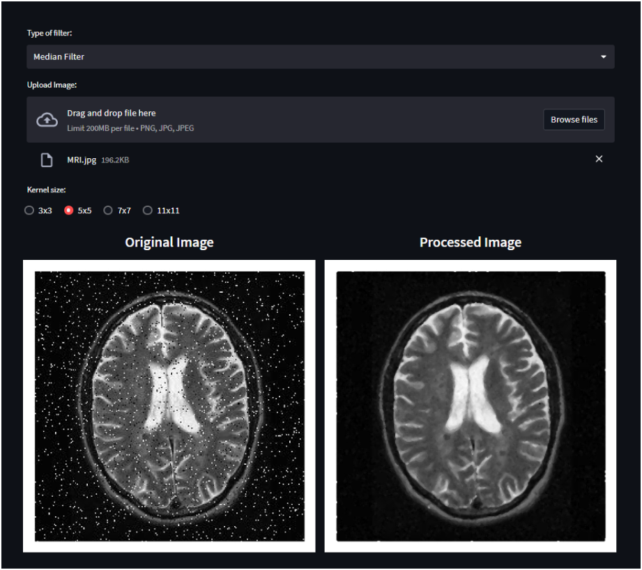
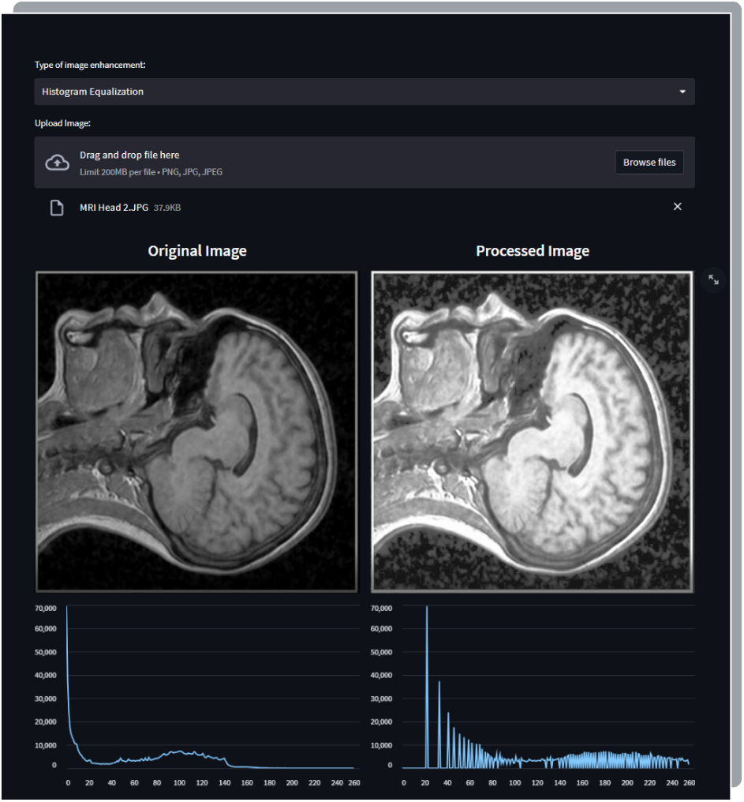
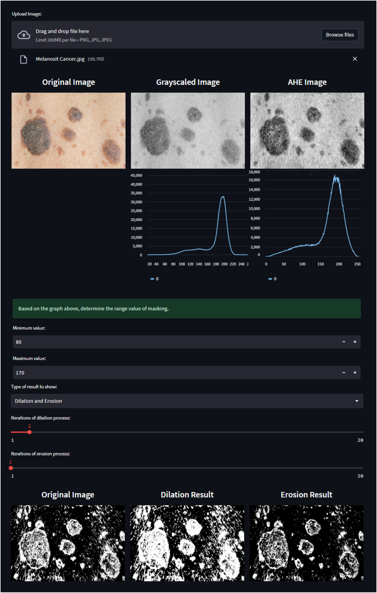
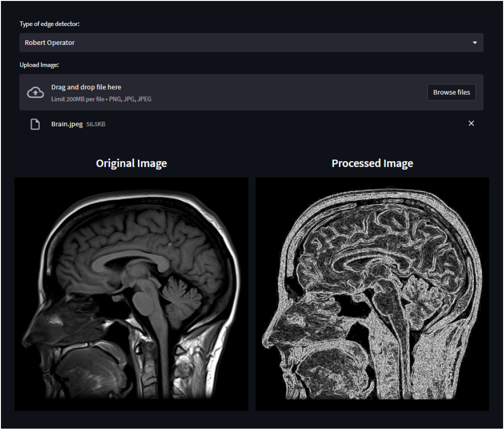

# Medical Image Processing Tools

This website features medical image processing tools, including image enhancement, filtering, edge detection, and masking, as well as performance evaluation metrics. 

#### Screenshot of Application

  
   &nbsp;&nbsp;&nbsp;
  

  
   &nbsp;&nbsp;&nbsp;
  

### Features:

1. Image Enhancement
   - Histogram Equalization: Adjusts image contrast by spreading out the intensity values, making features more distinguishable.
   - Adaptive Histogram Equalization (AHE): A variant of histogram equalization that improves local contrast and is useful for images with varying lighting conditions.
   - Contrast Stretching: Expands the range of intensity levels in an image, improving the distinction between different regions.
 
2. Image Filtering
   - Mean Filter: A simple averaging filter that smooths an image by reducing noise but may blur edges.
   - Max-Min Filter: Enhances or reduces features based on the maximum or minimum pixel intensity in a defined region.
   - Gaussian Filter: Applies a Gaussian function to smooth images and reduce detail and noise, often used as a pre-processing step.
   - Median Filter: Reduces noise, particularly salt-and-pepper noise, while preserving edge sharpness.

3. Edge Detection
   - Derivative Filter: Detects edges by computing the gradient of the image intensity.
   - Sobel Operator: Uses convolution with a 3x3 filter to detect edges based on intensity changes in the horizontal and vertical directions.
   - Prewitt Operator: Similar to Sobel but with a simpler kernel, used to detect edges based on gradients.
   - Robert Operator: A simple and quick method to detect edges by using diagonal gradients.
   - Laplacian Operator: Identifies edges by highlighting regions of rapid intensity change without considering direction.
   - Canny Edge Detector: A multi-step algorithm that provides a robust way to detect edges by combining gradient analysis and edge tracking.

4. Image Masking
   - Basic Masking: Applies a binary mask to an image to highlight or suppress certain regions.
   - Dilation and Erosion: Morphological operations that adjust object boundaries by adding (dilation) or removing (erosion) pixels.
   - Opening and Closing: Sequences of dilation and erosion used to remove noise (opening) or close small gaps (closing) in image features.

5. Performance Evaluation
   - Equivalent Number of Looks (ENL): A measure of the smoothness of an image, often used in speckle noise reduction techniques.
   - Peak Signal-to-Noise Ratio (PSNR): Assesses the quality of a processed image by comparing the difference between the original and processed image, with higher values indicating better quality.
   - Normalized Mean (NM): A statistical measure used to compare the mean values of two images, often used in image comparison tasks.

### Links
- Live Site URL: [https://medical-image-processing.streamlit.app](https://medical-image-processing.streamlit.app/)

## Other Projects
- Portfolio Website - [angeline-portfolio.netlify.app](https://angeline-portfolio.netlify.app)
